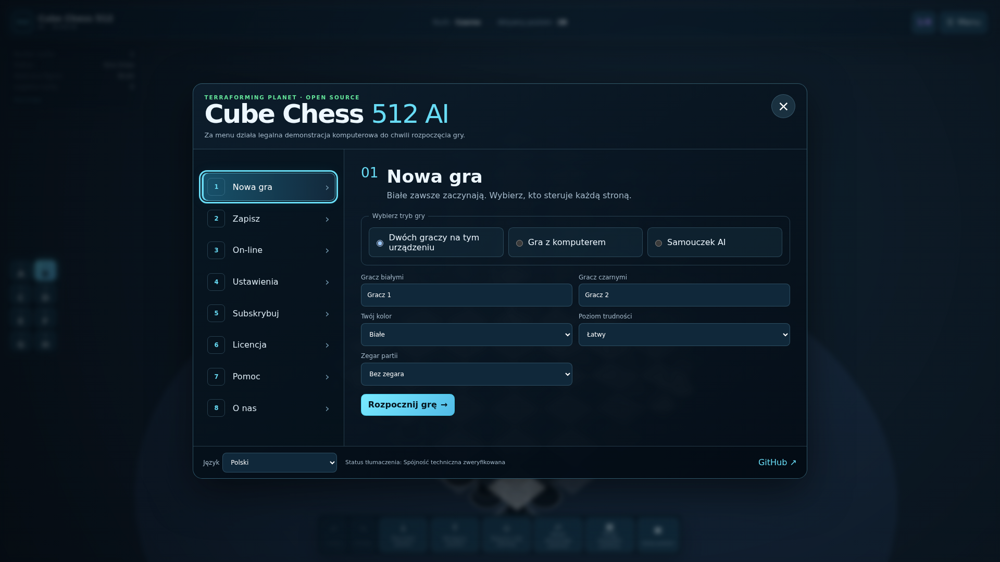

# Cube Chess 512 AI — Open Source Edition

> [!IMPORTANT]
> ## Open-source milestone completed
>
> On **5 August 2026**, the current active-development phase of this public
> edition was concluded as a completed open-source milestone.
>
> This repository remains public, playable and preserved under the MIT License.
> It is not being deleted or abandoned, and development may return here in the
> future. The source history, documentation and browser release remain available
> as the technical foundation and historical record of the project.
>
> The next production phase is planned as a separate commercial project built in
> Unreal Engine under the preliminary working title **CHESS ARENA 512 AI**. That
> project will use a separate repository, asset pipeline, release process and
> commercial licensing model. The working title may still be refined before
> trademark filing, store registration or commercial launch.
>
> The commercial successor may reuse the original code and architecture from
> this repository. Any open-source or third-party components included in a future
> product will remain subject to their respective licenses and required notices.

[Play the current browser release](https://teslaeco.github.io/Cube-Chess-512-AI-Open-Source-3D-Chess-Engine-Autonomous-AI-Game-Developer/)

Cube Chess 512 AI is an open-source 8×8×8 chess project. One continuous 3D
lattice contains 512 addressable cells across levels A–H. The rules engine is
kept independent from Three.js and the browser UI.



## Open-source milestone and future direction

This edition established a working foundation for three-dimensional chess across
512 addressable cells, including:

- legal movement and captures across all three spatial axes;
- an engine separated from the Three.js presentation layer;
- local play and a Web Worker computer opponent;
- deterministic state restoration, undo, redo and local saves;
- responsive browser, PWA and desktop-build foundations;
- localization and accessibility infrastructure;
- an authoritative local multiplayer test server;
- automated unit, integration, browser and production-build validation.

Future commercial production is expected to focus on a dedicated Unreal Engine
implementation with professional 3D assets, cinematic animation, advanced AI,
authoritative hosted multiplayer, cross-platform delivery and a commercial beta
programme. The preliminary commercial working title is documented as
[CHESS ARENA 512 AI](docs/project-transition/chess-512-ai-working-title.md). No
public release date or production feature is claimed by this repository.

## Thanks and collaboration

Thank you to everyone who tested the game, reviewed its behaviour, reported
problems, shared ideas, supported the documentation or followed the project's
development. Every test and discussion helped turn an experimental concept into
a playable 8×8×8 chess system.

This is the conclusion of the first public development chapter, not the end of
the project. Research, publishing, Unreal Engine development and commercial
collaboration proposals may be directed to the project owner through the
[teslaeco GitHub profile](https://github.com/teslaeco).

## Current implementation

- legal pointer and touch moves, captures, turn changes, check, checkmate and
  stalemate;
- legal cross-level movement with persistent highlights, a path guide, piece
  animation and camera tracking;
- corrected upward pawn movement for both colours and diagonal-only bishops;
- undo, redo, exact state restoration and versioned local saves in IndexedDB;
- an eight-section start menu, local two-player mode and a Web Worker computer
  opponent with three search limits;
- a legal engine-driven attract demo that stops when a real game starts;
- responsive desktop, phone and tablet layouts, keyboard focus handling, RTL,
  high contrast, large text and reduced-motion preferences;
- 38 BCP 47 locale choices, including `ar-PS`. Polish and English are complete;
  other languages are explicitly labelled machine drafts and fall back to
  English for untranslated copy;
- an optional, sandboxed-in-scope Mini Computer 1/8 for game saves, safe
  external search and user-selected local audio;
- a PWA shell, a local authoritative WebSocket test server and Tauri 2 release
  configuration for Windows, Linux and both macOS architectures.

The [implementation checklist](docs/tasks/major-playability-product-upgrade.md)
separates completed work from unfinished product features. In particular, the
public GitHub Pages site does **not** claim that multiplayer regions, payments,
signed desktop binaries or human-verified global translations are live.

## Run the web game

```bash
npm ci
npm run dev
```

Use the URL printed by Vite. To validate a production build:

```bash
npm run typecheck
npm run test
npm run build
npm run smoke:dist
```

Three.js `0.169.0` is a pinned npm dependency. The built game no longer needs a
runtime CDN connection.

## Browser interaction tests

```bash
npx playwright install chromium firefox webkit
npm run test:e2e
```

The test matrix covers Chromium, Firefox and WebKit on desktop, phone and tablet
profiles. Tests click projected Three.js objects through the real canvas rather
than calling presentation methods as a substitute for user input.

## Local multiplayer test server

```bash
npm run server:start
```

The server listens on `127.0.0.1:8787` by default. It exposes `/health` and
`/regions`, validates room moves against the authoritative engine and supports
room rejoin, spectators and sequence numbers. It is development infrastructure,
not eight deployed production servers. See
[the server guide](docs/online-test-server.md).

## PWA and desktop

The web build contains a manifest, versioned service worker, local icon and
offline shell. Tauri development uses the same UI:

```bash
npm run desktop:dev
npm run desktop:build
```

The release workflow prepares draft, unsigned prerelease artifacts for Windows
x64, Linux x64, macOS Intel and macOS Apple Silicon. Signing, notarization and a
real release tag remain owner-operated steps. See
[the desktop build guide](docs/desktop-builds.md).

## Deployment

`.github/workflows/deploy-pages.yml` is the only Pages publisher. It runs unit,
integration, browser and production-artifact smoke tests before deploying
`dist`. Pages must use **GitHub Actions** under **Settings → Pages → Build and
deployment**.

## Project status and boundaries

The browser edition remains interactively playable, but the broader product
roadmap is not represented as complete. Replay navigation, a teaching and
explanation layer, a curated demo ending in a proved checkmate, hosted
multiplayer and lobbies, full settings, strict typing of the remaining
JavaScript UI, signed desktop installers and professional review of draft
translations remain possible future work. See the
[audit](docs/audits/playability-and-ui-audit.md) and
[roadmap](docs/roadmap/full-product-roadmap.md).

## Ownership and licensing

The original 8×8×8 game concept and this project were created by **Sebastian
Laskowski**, operating through the Tesla Eco account and the Terraforming Planet
organization.

The source code in this repository remains available under the MIT License.
Existing permissions granted under that license are unchanged. The MIT License
does not grant ownership of the project name, future commercial branding or
separately produced proprietary assets.


