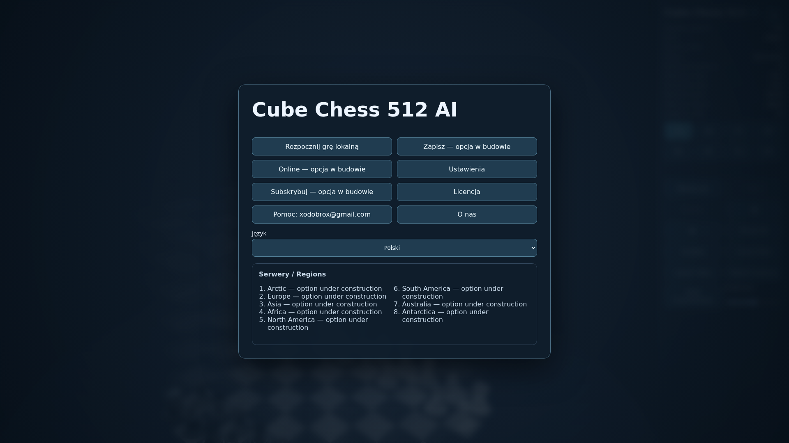
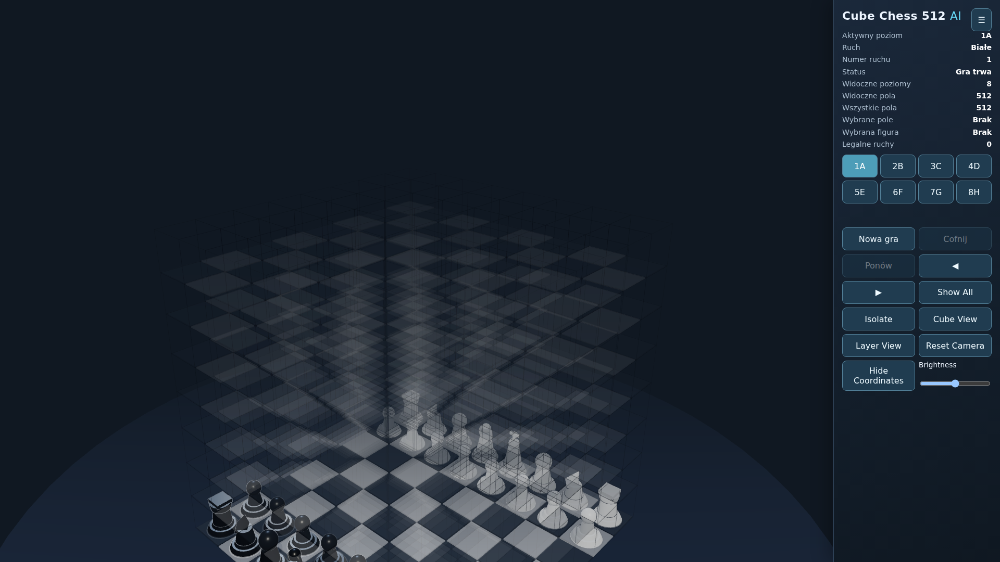
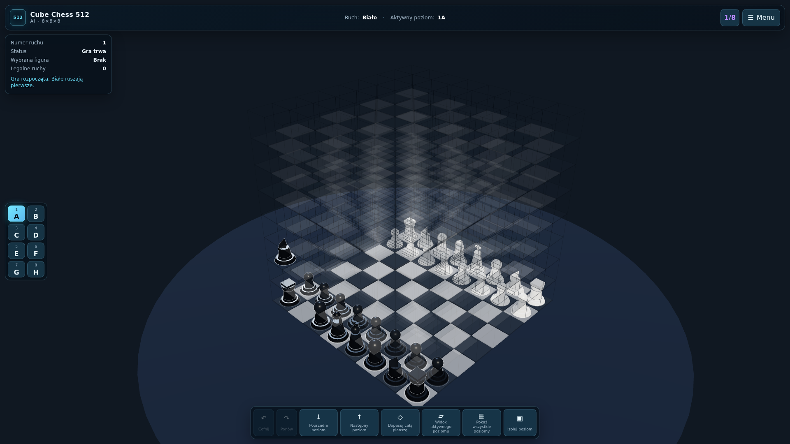
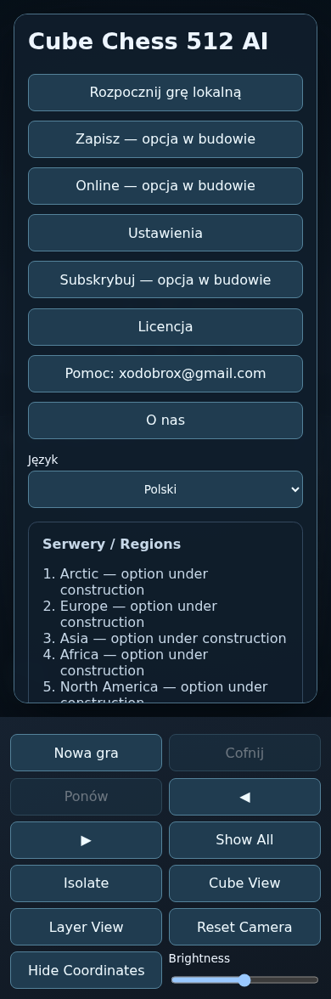
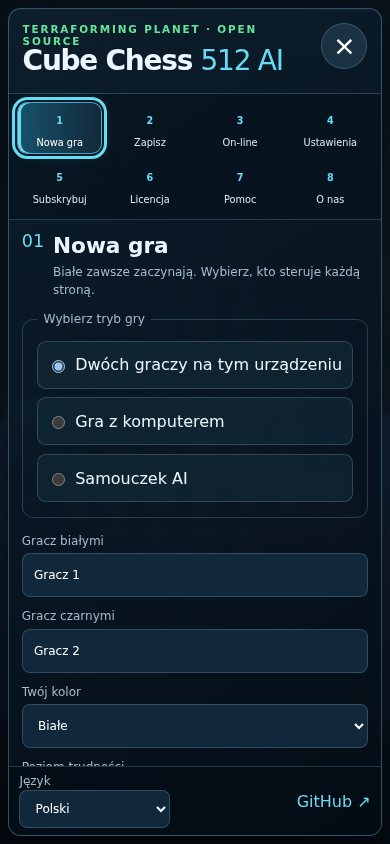
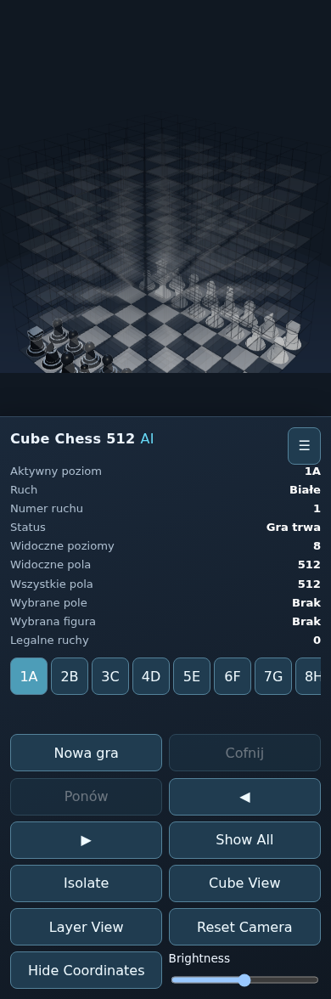
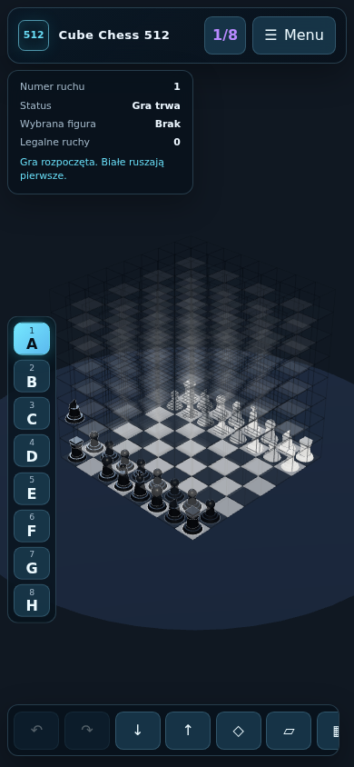

# Playability and UI audit

Audit baseline: `3fd5c4597e8978f90406b8fb99e97b669bdd2772` (`main`, after PR #16).

## Baseline verification

The baseline installed, type-checked, passed its 35 unit tests and built. That
proved engine-facing methods but did not prove that a person could complete a
move through WebGL. Production `dist` was also inspected separately from the
development server.

| Symptom / reproduction | Root cause | Expected behaviour | Fix and verification |
| --- | --- | --- | --- |
| Unit tests passed while a real canvas click could still fail. | Tests called `GamePresentation` methods and did not raycast a displayed mesh. | A projected piece click and projected target click execute a move. | Playwright now clicks actual canvas coordinates derived from the live Three.js objects and verifies the turn. |
| Clicking an opponent on a legal capture square could reject the input. | `GamePresentation.selectPiece` checked ownership before treating the piece as a selected capture target. | The opponent mesh is a capture destination when it matches a legal target. | Capture-target precedence is explicit and covered by unit and canvas E2E tests. |
| Releasing the pointer after orbiting could select a square. | `pointerup` was handled as a click with no gesture-distance check. | Camera drag must not select or move. | `SelectionController` records pointer-down coordinates and accepts only movement within seven pixels; unit and E2E regression tests cover it. |
| Black pawns on level A could not move upward. | Pawn height direction was tied to colour, so Black requested `z - 1` from `z = 0`. | Both colours progress A→H in the height dimension; rank direction remains colour-dependent. | Pawn move generation and attack detection now use `z + 1` for both colours, with A→B, capture, blocking and H-boundary tests. |
| The user report said a bishop behaved like a queen. | The generator was already diagonal, but there was no regression spanning generator, adapter and highlighted targets. | A bishop changes two or three coordinates by equal absolute amounts and never moves on one axis. | Direction, blocking and browser presentation tests protect bishop/rook/queen separation. |
| Zooming out darkened or erased the board. | `THREE.Fog` was enabled in `SceneController`. | Distance must not change exposure or colour. | Fog is absent by default and can only be enabled in Graphics settings. |
| The cube or menu could be clipped on desktop and phone. | The camera used fixed coordinates; the HUD occupied a permanent column; the old phone menu flowed into the HUD. | Fit the complete board and keep menu controls reachable in each viewport. | Camera fit uses a 3D bounding sphere, HUD controls are overlays, the menu has its own scroll area/safe-area handling, and viewport containment is tested. |
| Most menu buttons looked interactive but were placeholders. | The menu contained labels without panel routing or actions. | Exactly eight numbered entries open accessible functional panels. | A focus-trapped dialog now provides New Game, Save, Online status, Settings, Pro concept, License, Help and About panels; `×` and Escape close without resetting a game. |
| Cross-level movement was hard to follow. | Highlights had no path and camera targets were fixed. | Keep selection while switching levels, show the target path, animate the piece and follow its height. | Purple height targets, dashed paths, smooth camera targets and a real A→B canvas test were added. |
| Pages could be published by two workflows. | Both `deploy-pages.yml` and `static.yml` deployed content. | One deterministic publisher must upload tested `dist`. | `static.yml` was removed; the remaining workflow requires build, smoke and multi-browser E2E jobs. |
| Offline/desktop builds depended on a public CDN. | Three.js and OrbitControls came from an import map. | Production assets must be bundled. | Three.js is pinned in npm and the production smoke test checks local JavaScript, CSS, manifest and service worker output. |

## Interaction and layout evidence

The automated checks use a real headless browser and real WebGL canvas. The
desktop and mobile Chromium runs cover menu navigation, persisted `ar-PS` RTL,
Escape/close behaviour, a rank move, A→B movement, clicking an enemy mesh to
capture, IndexedDB save/reload restoration, camera drag, AI moving first, demo
cleanup and viewport containment.

| Runtime | Profile | Result |
| --- | --- | --- |
| Chromium | 1366×768 desktop | Passed locally |
| Chromium | Pixel 7 phone profile | Passed locally |
| Firefox | 1920×1080 desktop | Configured in Playwright/CI; see final PR check result |
| WebKit | 1366×768 desktop | Configured in Playwright/CI; see final PR check result |
| Mobile Safari | iPhone 13 profile | Configured in Playwright/CI; see final PR check result |
| WebKit tablet | iPad (7th generation) | Configured in Playwright/CI; see final PR check result |

### Before and after — desktop

| Baseline | Updated |
| --- | --- |
|  |  |
|  |  |

### Before and after — phone

| Baseline | Updated |
| --- | --- |
|  |  |
|  |  |

The baseline screenshots were rendered from the audited commit in a detached
worktree; the updated screenshots were rendered from this branch at 1920×1080
and 390×844.

## Remaining audit findings

These are intentionally not described as complete:

- the demo chooses legal showcase moves for roughly one minute, but it is not a
  curated sequence proving a final checkmate or every requested piece/capture;
- the tutorial option currently uses the legal AI opponent without a complete
  move-by-move explanation layer;
- the WebSocket server is runnable and tested locally, but lobby/invitation UI,
  authentication, rate limiting, moderation and hosted endpoints remain absent;
- non-Polish/non-English locale catalogs use explicit English fallback and are
  machine drafts, not full human-reviewed translations;
- critical engine and server TypeScript are strict, while the remaining browser
  JavaScript still needs an incremental strict TypeScript migration;
- desktop workflows are configured, but no signed/notarized artifacts exist
  until an owner creates a release and supplies platform credentials.
